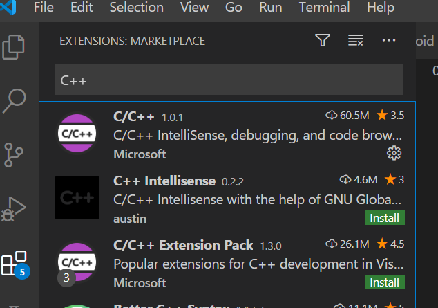

# VSCode C++安裝

## VSCode版本

VSCode Version: 1.48.2 (user setup)

## 安裝套件

<!--
圖片1

圖片2
<div align="center">

</div>
-->
<div align="left">

</div>

## 安裝 mingw-w64 編譯器

Google搜尋mingw-w64
<div align="left">

</div>

點選Files頁面
<div align="left">

</div>

下載x86_64-win32-seh
<div align="left">

</div>

下載下來後可以透過 7 Zip 進行解壓縮，會得到一個名字是 mingw64 的資料夾。
將該資料夾移動到系統碟根目錄下，通常路徑是 "C:\mingw64\"。

## 環境變數
將 mingw64 裡的 bin 資料夾添加到環境變數路徑中。  
打開 CMD 輸入如下指令 where gcc，如果出現你添加的路徑，那就成功了

## 執行
* 新增資料夾 HelloWorld
```
mkdir HelloWorld 
cd HelloWorld 
code .
```
* 新增檔案 helloworld.cpp

<div align="left">

</div>

* 在 helloworld.cpp 輸入代碼
```c++
include <iostream>
int main() 
{ 
std::cout << "Hello World" << std::endl; 
} 
```
* Build  
Terminal>Run Build Task…

<div align="left">

</div>

顯示一個帶有各種編譯器任務選項的下拉列表。  
選擇 C/C++: g++.exe build active file

<div align="left">

</div>

* Run
這將編譯 helloworld.cpp 並創建一個名為 的可執行文件 helloworld.exe  
輸入 .\helloworld

<div align="left">

</div>

## VS Code 環境設定

* 設定 c_cpp_properties.json  
* 在打開 “HelloWorld.cpp” 的狀態下按 F1，於命令列輸入：C/C++: Edit Configurations (UI) 
*打開設定頁面。
* 編譯器路徑 選擇：../g++.exe 的選項
* IntelliSense 模式 選擇：gcc-x64 的選項
* 設定 tasks.json 
* 在打開 “HelloWorld.cpp” 的狀態下按 F1，於命令列輸入：Tasks: Configure Default Build 
Task，然後選擇：C/C++ g++.exe 建置使用中檔案，即可完成設定。
* 設定 launch.json 
* 最後在打開 “HelloWorld.cpp” 的狀態下按 F5，選擇：g++.exe 建置及偵錯使用中的檔案。
* 即可完成所有設定並開始

```
{ 
 // Use IntelliSense to learn about possible attributes.
 // Hover to view descriptions of existing attributes.
 // For more information, visit: https://go.microsoft.com/fwlink/?linkid=830387
 "version": "0.2.0", 
 "configurations": [ 
 { 
 "name": "g++.exe - 建置及偵錯使用中的檔案", 
 "type": "cppdbg", 
 "request": "launch", 
 "program": "${fileDirname}\\${fileBasenameNoExtension}.exe", 
 "args": [], 
 "stopAtEntry": false, 
 "cwd": "${workspaceFolder}", 
 "environment": [], 
 "externalConsole": false, 
 "MIMode": "gdb", 
 "miDebuggerPath": "C:\\Program Files\\mingw-w64\\x86_64-8.1.0-posix-seh
-rt_v6-rev0\\mingw64\\bin\\gdb.exe", 
 "setupCommands": [ 
 { 
 "description": "啟用 gdb 的美化顯示", 
 "text": "-enable-pretty-printing", 
 "ignoreFailures": true
 } 
 ], 
 "preLaunchTask": "C/C++: g++.exe build active file"
 } 
 ]

```